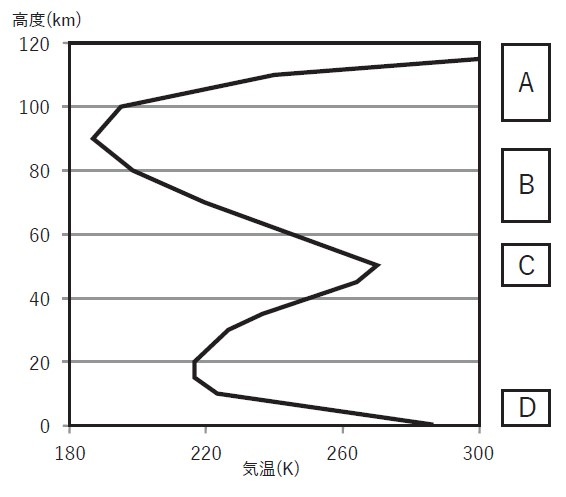

# 気象予報士試験　一般知識

## 第54回 問1

図は標準的な大気における気温の鉛直分布を示したものである。図のA~Dの矩形で示された高度における気層の特性について述べた次の文(a)~(d)の正誤の組み合わせとして正しいものを,下記の①~⑤の中から1つ選べ。

* (a)気層Aでは,大気が波長の短い紫外線などを吸収して,高度が高いほど気温も高い。
* (b)電離層は紫外線の作用により形成され,その大部分は気層Bの中にある。
* (c)気層Cのオゾンの数密度は,大気曹全体の中で最も大きい。
* (d)気層Dにおける気温の平均的な鉛直分布は,放射のバランスと対流による大気の鉛直混合および水蒸気の凝結過程によりほぼ決まる。

